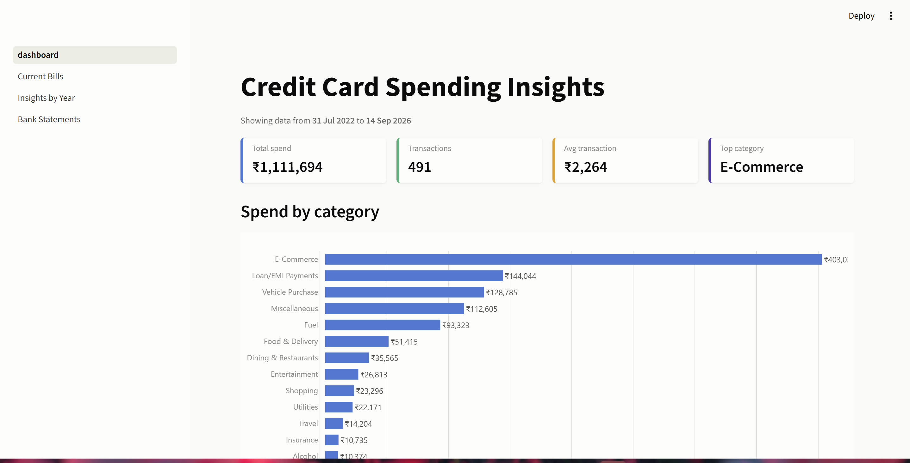
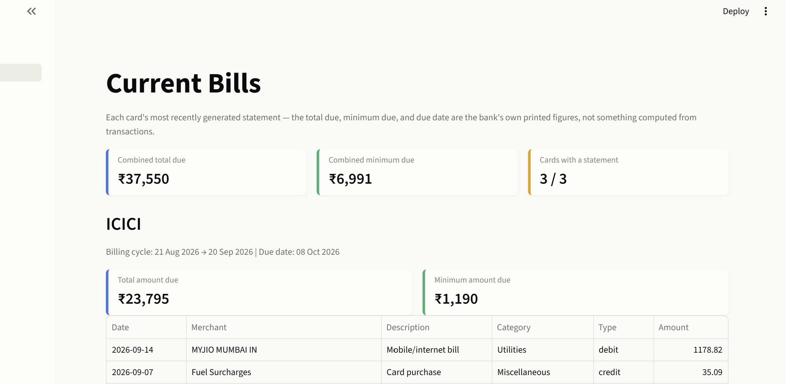
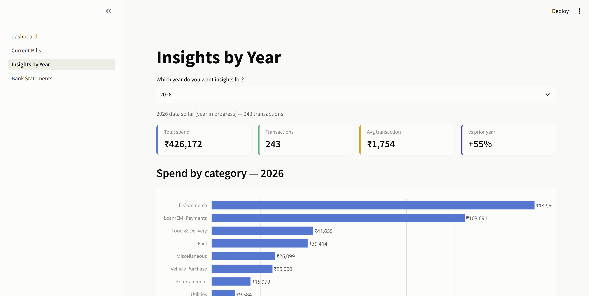

# Credit Card Analyzer

Pulls HDFC / ICICI / Axis credit card *and* savings account statements
straight out of Gmail, unlocks the password-protected PDFs, parses every
transaction with hand-built regex parsers (no LLM, no API cost), and serves
a multi-page Streamlit dashboard for spend analysis.

Each parser was built by reverse-engineering the real PDF layout for that
bank and validated against the bank's own printed totals (statement "Total
Amount Due", deposit/withdrawal sums, opening/closing balance) — not just
eyeballed.

## Screenshots

**Main dashboard** — spend by category, monthly trend, year-over-year chart,
top merchants, and a "Smart Insights" panel that mines the transaction
history for patterns (not just category totals restated as text).



**Current Bills** — each card's most recently generated statement, pulled
from the bank's own printed "Total Amount Due" / "Minimum Due" figures
rather than summed from transactions (which can't reproduce previous-balance
carryover or multi-card statement consolidation).



**Insights by Year** — pick a year, see that year's category breakdown,
monthly trend, top merchants, and year-over-year deltas.



There's also a **Bank Statements** page (not pictured) covering savings/current
account activity — balance over time, income vs. expense, and category
breakdown, with self-transfers between your own accounts tracked separately
so they don't inflate either side.

## How it works

```
Gmail  →  fetch_statements.py  →  parse_statement.py  →  bank_parsers.py /
(search    (download PDF          (unlock with           account_parsers.py
 by sender  attachments)           pikepdf, extract        (regex per bank,
 /subject)                         text/tables with        validated against
                                    pdfplumber)             printed totals)
                                                                   │
                                                                   ▼
                                                    categorize.py / categorize_account.py
                                                                   │
                                                                   ▼
                                                        SQLite (src/db.py)
                                                                   │
                                                                   ▼
                                                   Streamlit dashboard (src/dashboard.py
                                                          + src/pages/*.py)
```

Credit card statements and savings/current account statements run through
**separate pipelines** (`main.py` / `main_accounts.py`) since they're
structurally different documents — one tracks card spend, the other tracks
account balance, deposits, and withdrawals.

## Setup

1. **Google Cloud (free, no billing needed)**
   - Go to console.cloud.google.com, create a project.
   - Enable the **Gmail API**.
   - Configure the OAuth consent screen: type **External**, publishing
     status **Testing**, add your own Gmail address as a test user.
   - Create credentials: **OAuth client ID**, application type **Desktop app**.
   - Download the JSON and save it as `credentials/credentials.json`.

2. **Python environment**
   ```
   cd credit-card-analyzer
   python -m venv venv
   venv\Scripts\activate
   pip install -r requirements.txt
   ```

3. **Secrets**
   - Copy `.env.example` to `.env`.
   - Fill in the PDF passwords for whichever banks/accounts you have. Banks
     usually state the password rule directly in the statement email (often
     a formula like "first 4 letters of name + DOB"), and it can differ
     between the credit card and the savings account, or even change over
     time (`HDFC_ACCOUNT_PDF_PASSWORD_OLD` exists for exactly that case).
   - Set `ACCOUNT_HOLDER_NAME` (your name as it appears in UPI narrations) so
     transfers between your own accounts are correctly excluded from
     income/expense. `HOUSING_SOCIETY_KEYWORD` is optional.
   - `ANTHROPIC_API_KEY` is **not required** — it's a leftover hook for
     swapping the regex parsers back to an LLM-based approach if a bank
     changes its format enough to break the regex; the current pipeline
     doesn't call it.

4. **First run**
   ```
   python src/main.py           # credit card statements
   python src/main_accounts.py  # savings/current account statements
   ```
   Each opens a browser window once for Gmail login/consent (shared between
   both), then fetches statement PDFs, unlocks them, parses transactions,
   and stores them in `data/transactions.sqlite3`. Safe to re-run —
   duplicates are skipped automatically.

5. **Dashboard**
   ```
   streamlit run src/dashboard.py
   ```
   Additional pages (Current Bills, Insights by Year, Bank Statements) show
   up automatically in the sidebar from `src/pages/`.

## Notes

- `credentials/`, `.env`, downloaded PDFs, and the SQLite database are all
  gitignored — nothing sensitive should ever get committed.
- Gmail search queries per bank live in `src/config.py` (`BANKS` for cards,
  `BANK_ACCOUNTS` for savings/current accounts) — adjust the sender
  address/subject line there if a real statement email doesn't match.
- Parsers assume each bank's PDF layout stays stable; if a bank changes its
  statement template, the relevant parser in `src/bank_parsers.py` or
  `src/account_parsers.py` will need updating (each has comments showing
  the exact line format it was built against).
- To automate monthly runs, schedule `python src/main.py` and
  `python src/main_accounts.py` via Windows Task Scheduler.
